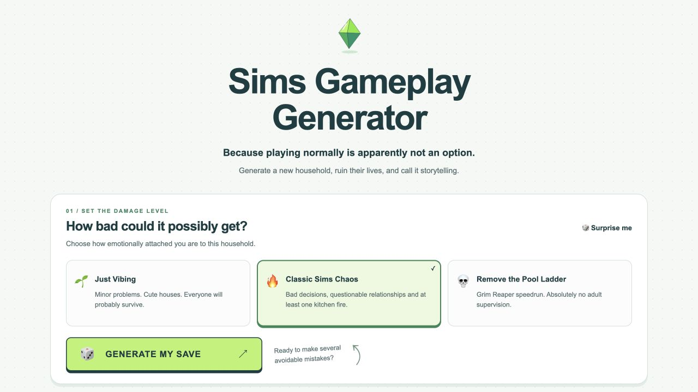
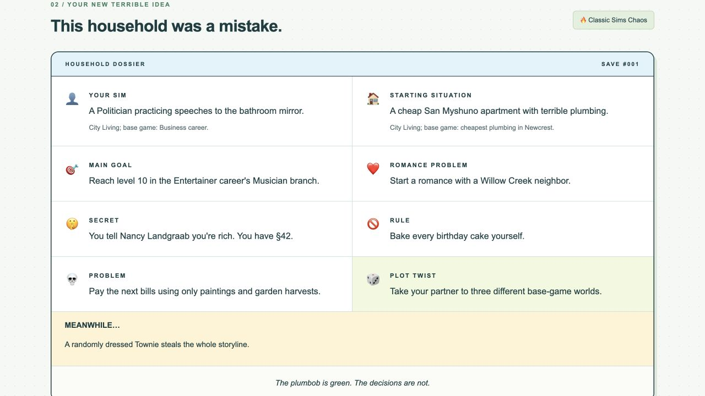
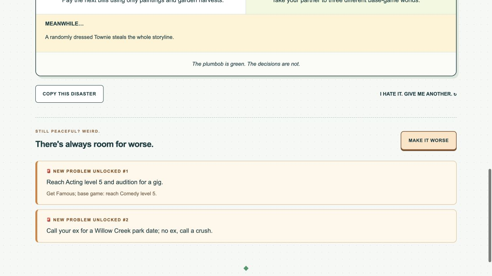

# Sims Gameplay Generator 

This was made to help me generate cool storylines for my Sims. 

[Sims gameplay generator](https://sims-gameplay-generator.netlify.app/)

## About the app

A gameplay generator for The Sims 4 with three chaos levels, 382 prompts, and stackable disasters. Familiar Townies, skill challenges, basement painters, and no Motherlode.

Built with vanilla HTML, CSS, and JavaScript. No backend, accounts, or installation required.

## Choose your chaos

## Meet your next terrible idea

## Make a bad situation worse

## Features

- Three modes, from Just Vibing to Remove the Pool Ladder.
- Eight story ingredients, plus optional events and extra disasters.
- Shared theme tags prevent repeated objectives across a save and its disasters.
- When distinct disasters run out, start a new save instead of recycling old ones.
- Copy the entire challenge, including every added disaster.
- Responsive layout, keyboard support, and reduced-motion preferences.

## Run locally

Open `index.html` in a browser. No build step or dependencies.

## Deploy

Upload the project folder to Netlify, or import the repository with an empty build command and `.` as the publish directory. `netlify.toml` includes the configuration.

## Project structure

- `data.js` — prompt pools, difficulty tiers, themes, and pack alternatives.
- `generator.js` — weighted selection and repeat prevention.
- `script.js` — page interactions and clipboard support.
- `styles.css` and `index.html` — the interface.
- `tests/` — generation and regression tests.
- `docs/screenshots/` — actual app screenshots.

Run tests with `node --test tests/generator.test.cjs`.

Some ideas use optional packs. Base-game substitutes are included. If a named Sim is unavailable, choose a similar Townie. Shared themes are curated metadata rather than a complete simulation of every possible game state.

Not affiliated with or endorsed by Electronic Arts or The Sims. 
